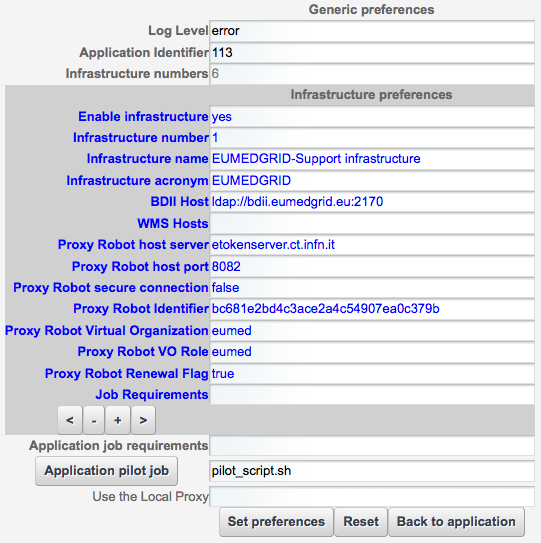
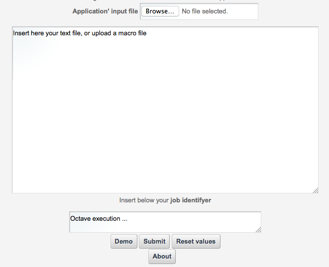

*********************
OCTAVE
*********************

============
About
============

-------------

 GNU Octave is a high-level interpreted language, primarily intended for numerical computations. It provides capabilities for the numerical solution of linear and nonlinear problems, and for performing other numerical experiments. It also provides extensive graphics capabilities for data visualization and manipulation.
The Octave language is quite similar to Matlab so that most programs are easily portable.

============
Installation
============
Following instructions are meant for science gateway maintainers while generic users can skip this section.
To install the portlet it is enough to install the war file into the application server and then configure the preference settings into the portlet preferences pane.

Preferences are splitted in three separate parts: Generic, Infrastructures and the application execution setting. 
The generic part contains the **Log level** which contains one of following values, sorted by decreasing level: info, debug, warning and error. 
The **Application Identifier** refers to theId field value of the GridEngine 'UsersTracking'database table: GridInteractions.
The infrastructure part consists of different settings related to the destination of users job execution. The fields belonging to this category are:

 **Enable infrastructure**: A true/false flag which enables or disable the current infrastructure;

 **Infrastructure Name**: The infrastructure name for these settings;   

 **Infrastructure Acronym**: A short name representing the infrastructure;

 **BDII host**: The Infrastructure information system endpoint (URL). Infrastructure preferences have been thought initially for the elite Grid based infrastructures; 

 **WMS host**: It is possible to specify which is the brokering service endpoint (URL);

 **Robot Proxy values**: This is a collection of several values which configures the robot proxy settings (Host, Port, proxyID, VO, Role, proxy renewal);

 **Job requirements**: This field contains the necessary statements to specify a job execution requirement, such as a particular software, a particular number of CPUs/RAM, etc.

Actually, depending on the infrastructure, some of the fields above have an overloaded meaning. Please contact the support for further information or watch existing production portlet settings.

============
Usage
============
The usage of the portlet is simple; the user can select to upload a local Octave macro file selecting the Browse button in the **Application input file** section, or insert inside the text field the Octave macro text by pasting a text or editing directly on the larger text box below.
The **job identifier** text is a human readable values that users will use to keep track of any job execution.
Following buttons: Demo, Submit, Reset values and About are respectively:

 *Demo* - Fills the Macro Text box with an Octave macro example

 *Submit* - Executes the given macro on the distributed infrastructure

 *Reset* - Resets the input form

 *About* - Gives an overview of the portlet

============
Contributor(s)
============
To get support such as reporting a bug, a problem or even request new features, please contact

.. _INFN: http://www.ct.infn.it/

:Authors:
 
 `Roberto BARBERA <mailto:roberto.barbera@ct.infn.it>`_ - Italian National Institute of Nuclear Physics (INFN_),
 
 `Riccardo BRUNO <mailto:riccardo.bruno@ct.infn.it>`_ - Italian National Institute of Nuclear Physics (INFN_),

